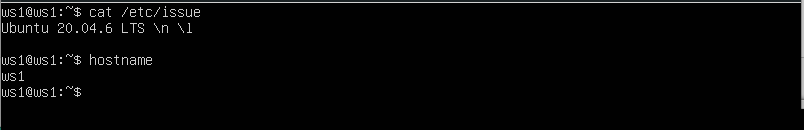
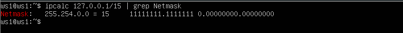
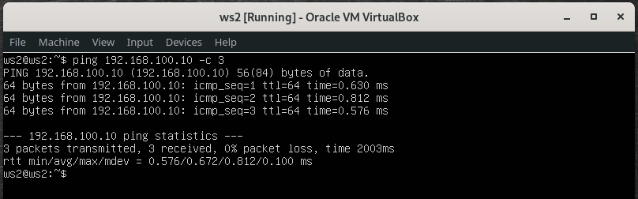
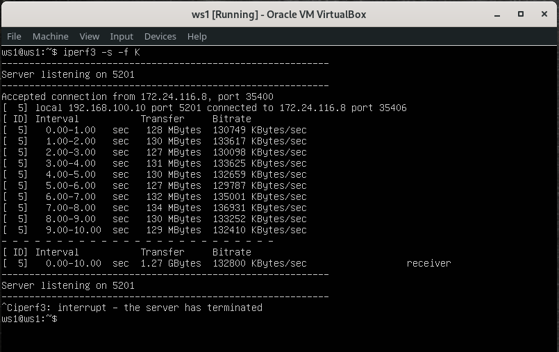
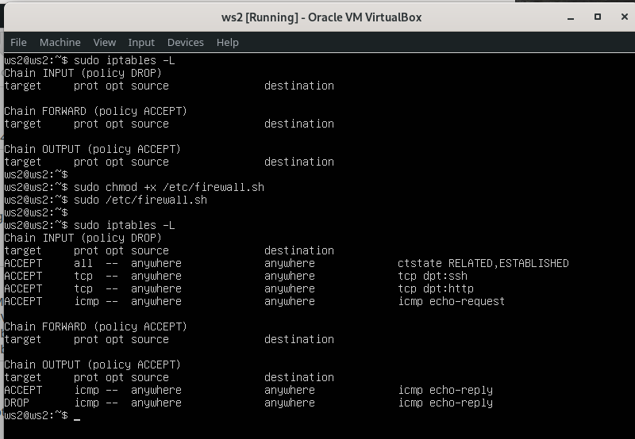
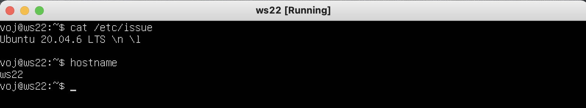
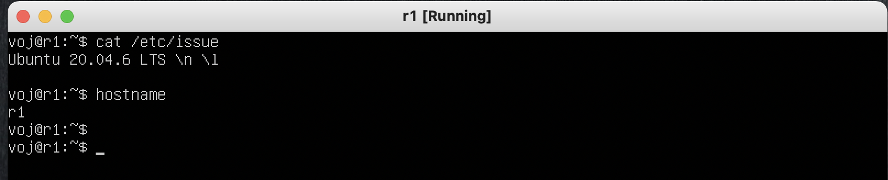
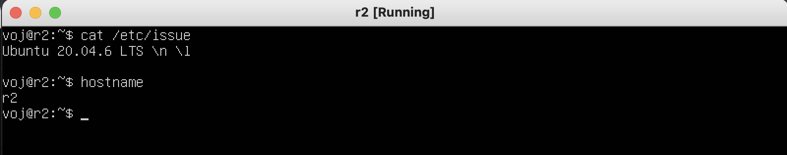

# Linux Network

Linux networks configuration on virtual machines.

## Contents

1. [ipcalc tool](#part-1-ipcalc-tool)
2. [Static routing between two machines](#part-2-static-routing-between-two-machines)
3. [iperf3 utility](#part-3-iperf3-utility)
4. [Network firewall](#part-4-network-firewall)
5. [Static network routing](#part-5-static-network-routing)

## Part 1. ipcalc tool

- Поднять вирутальную машину (ws1): \
  

#### 1.1. Сети и маски

- Определить адрес сети 192.167.38.54/13: \
  **Ответ: 192.160.0.0** \
  
- Перевод маски 255.255.255.0 в префиксную и двоичную запись: \
  **Ответ: /24 и 11111111.11111111.11111111.00000000** \
  
- Перевод маски /15 в обычную и двоичную запись: \
  **Ответ: 255.254.0.0 и 11111111.11111110.00000000.00000000** \
  
- Перевод маски 11111111.11111111.11111111.11110000 в обычную и префиксную запись: \
  **Ответ: 255.255.255.240 и /28** \
  
- Минимальный и максимальный хост в сети 12.167.38.4 при маске /8: \
  **Ответ: минимальный адрес - 12.0.0.1, максимальный - 12.255.255.254** \
  
- Минимальный и максимальный хост в сети 12.167.38.4 при маске 11111111.11111111.00000000.00000000: \
  **Ответ: минимальный адрес - 12.167.0.1, максимальный - 12.167.255.254** \
  
- Минимальный и максимальный хост в сети 12.167.38.4 при маске 255.255.254.0: \
  **Ответ: минимальный адрес - 12.167.38.1, максимальный - 12.167.39.254** \
  
- Минимальный и максимальный хост в сети 12.167.38.4 при маске /4: \
  **Ответ: минимальный адрес - 0.0.0.1, максимальный - 15.255.255.254** \
  

#### 1.2. localhost

- Определить, можно ли обратиться к приложению, работающему на localhost, со следующими IP: \
  194.34.23.100, 127.0.0.2, 127.1.0.1, 128.0.0.1 \
  **Ответ: 127.0.0.2, 127.1.0.1 - да; 194.34.23.100, 128.0.0.1 - нет** \
   \
  

#### 1.3. Диапазоны и сегменты сетей

- Какие из перечисленных IP можно использовать в качестве публичного, а какие только в качестве частных: \
  **Ответ: публичные адреса - 134.43.0.2,  172.0.2.1, 192.172.0.1, 172.68.0.2 и 192.169.168.1; \
           частные адреса - 10.0.0.45, 192.168.4.2, 172.20.250.4, 172.16.255.255, 10.10.10.10** \
  
- Какие из перечисленных IP адресов шлюза возможны у сети 10.10.0.0/18: \
  **Ответ: для шлюза подходят адреса - 10.10.0.2, 10.10.10.10 или 10.10.1.255;** \
  **не подходят - 10.0.0.1 и 10.10.100.1 - так как они находятся вне данной подсети** \
  
  
## Part 2. Static routing between two machines

- Поднять две виртуальные машины (ws1 и ws2): \
   \
  Добавим по дополнительному сетевому интерфейсу (internal network) для каждой из машин:
  - машина ws1 \
    
  - машина ws2 \
    
- С помощью команды `ip a` посмотреть существующие сетевые интерфейсы:
  - машина ws1 \
    
  - машина ws2 \
    
- Описать сетевой интерфейс, соответствующий внутренней сети, на обеих машинах и задать следующие адреса и маски. \
  Для этого изменим конфигурационные файлы командой `sudo vim /etc/netplan/00-installer-config.yaml`, описав интерфейсы `enp0s8`:
  - ws1 - 192.168.100.10, маска /16 \
    
  - ws2 - 172.24.116.8, маска /12 \
    
- Выполнить команду `netplan apply` для перезапуска сервиса сети:
  - машина ws1 \
    
  - машина ws2 \
    

#### 2.1. Добавление статического маршрута вручную

- Добавить статический маршрут от одной машины до другой и обратно при помощи команды `ip r add`
  - машина ws1 : `$>sudo ip r add 172.24.116.8 dev enps08` \
    
  - машина ws2 : `$>sudo ip r add 192.168.100.10 dev enps08` \
    
- Пропинговать соединение между машинами
  - Пинг машины ws2 \
    
  - Пинг машины ws1 \
    

#### 2.2. Добавление статического маршрута с сохранением
- Перезапустить машины командой `reboot`
  - ws1: \
    
  - ws2: \
    
- Добавить статический маршрут от одной машины до другой с помощью файла etc/netplan/00-installer-config.yaml:
  - машина ws1: `$sudo vim /etc/netplan/00-installer-config.yaml` \
     \
    
  - машина ws2: `$sudo vim /etc/netplan/00-installer-config.yaml` \
     \
    
- Пропинговать соединение между машинами:
  - Пинг машины ws2 \
    
  - Пинг машины ws1 \
    

## Part 3. iperf3 utility

#### 3.1. Скорость соединения

- Перевести и записать в отчёт: 8 Mbps в MB/s, 100 MB/s в Kbps, 1 Gbps в Mbps:
  - 8 Mbps = 1 MB/s;
  - 100 MB/s = 819200 Kbps (для двоичных приставок Меби и Киби); \
    100 MB/s = 800000 Kbps (для десятичных приставок Мега и Кило);
  - 1 Gbps = 1024 Mbps (для двоичных приставок Гиби и Меби); \
    1 Gbps = 1000 Mbps (для десятичных приставок Гига и Мега);
- Измерить скорость соединения между ws1 и ws2:
  - на машине ws2 запустим сервер iperf3 командой `$>iperf3 -s -f K` \
    
  - на машине ws1 запустим клиент iperf3 командой `$>iperf3 -c 172.24.116.8 -f K` \
    
  - **Битрейт отправителя (ws1) - 127798 KBytes/sec;** \
    **Битрейт получателя (ws2) - 127629 KBytes/sec;**
  - на машине ws1 запустим сервер iperf3 командой `$>iperf3 -s -f K` \
    
  - на машине ws2 запустим клиент iperf3 командой `$>iperf3 -c 192.168.100.10 -f K` \
    
  - **Битрейт отправителя (ws2) - 132990 KBytes/sec;** \
    **Битрейт получателя (ws1) - 132800 KBytes/sec;**

## Part 4. Network firewall

#### 4.1. Утилита iptables

- Создать файл /etc/firewall.sh, имитирующий фаерволл, на ws1 и ws2:
  - Машина ws1: \
    
  - Машина ws2: \
    
- Запустить файлы на обеих машинах командами `$>chmod +x /etc/firewall.sh` и `$>/etc/firewall.sh`:
  - Машина ws1: \
    
  - Машина ws2: \
    
- Правила обрабатываются в порядке их следования в таблице. Поэтому для исходящего icmp пакета на машине ws1 сначала будет следовать действие REJECT (отклонить пакет), и следующее действие ACCEPT (разрешение) уже не имеет силы, и соответственно эта машина не пингуется, т.е. не отвечает на запрос icmp. На машине ws2 напротив действие REJECT следует после действия ACCEPT, в результате чего исходящий пакет будет отправлен, т.е. машина будет пинговаться.

#### 4.2. Утилита nmap

- Командой ping найти машину, которая не "пингуется", после чего утилитой nmap показать, что хост машины запущен:
  - Успешный пинг машины ws2 с машины ws1 \
    
  - Неуспешный пинг машины ws1 с машины ws2 и вывод утилиты `nmap` \
    

## Part 5. Static network routing

- Cеть: \
  
- Поднять пять виртуальных машин (3 рабочие станции (ws11, ws21, ws22) и 2 роутера (r1, r2)) \
   \
   \
   \
   \
  
