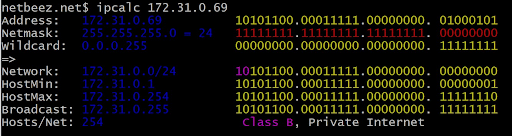

# Linux Network

Linux networks configuration on virtual machines.

## Contents

1. [ipcalc tool](#part-1-ipcalc-tool)

## Part 1. **ipcalc** tool

- Поднять вирутальную машину (ws1)

- Загрузка образа операционной системы ubuntu-20.04 LTS и проверка чек-суммы. \
  
